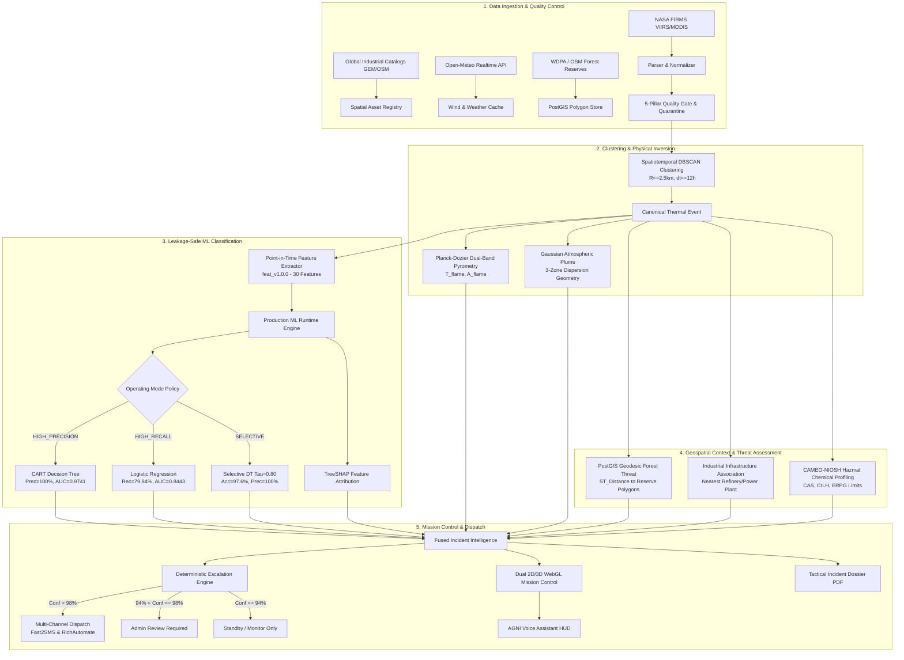
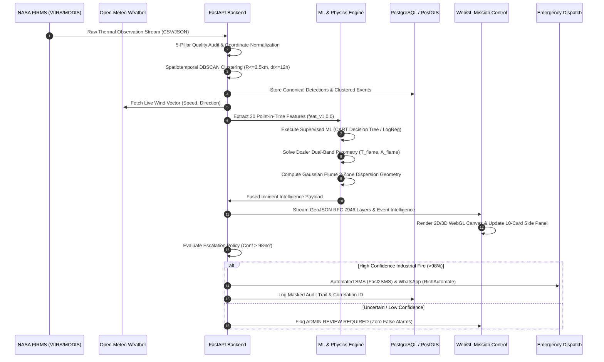

# PyroSat-AI V2.5

**AI-Powered Satellite Thermal Anomaly Detection & Geospatial Intelligence Platform for Industrial Flame Segregation, Physical Pyrometry, Atmospheric Plume Modeling, and Multi-Agency Emergency Response.**

[](https://python.org)
[](https://fastapi.tiangolo.com)
[](https://nextjs.org)
[](https://postgis.net)
[](https://pytest.org)
[](https://astral.sh/ruff)

---

## Table of Contents

1. [Project Overview](#1-project-overview)
2. [Problem Statement](#2-problem-statement)
3. [Expected Solution](#3-expected-solution)
4. [Our Solution](#4-our-solution)
5. [System Architecture](#5-system-architecture)
6. [Machine Learning Engine](#6-machine-learning-engine)
7. [ML Feature Catalog & Engineering](#7-ml-feature-catalog--engineering)
8. [Complete Feature Inventory](#8-complete-feature-inventory)
9. [Implemented Product Features](#9-implemented-product-features)
10. [GIS & Geospatial Intelligence](#10-gis--geospatial-intelligence)
11. [GIS Layer Catalog](#11-gis-layer-catalog)
12. [Thermal Event Intelligence](#12-thermal-event-intelligence)
13. [Physics, Pyrometry & Plume Dispersion](#13-physics-pyrometry--plume-dispersion)
14. [Tactical Incident Briefing & Dossier](#14-tactical-incident-briefing--dossier)
15. [Forest & Wilderness Intelligence](#15-forest--wilderness-intelligence)
16. [AGNI Voice Assistant](#16-agni-voice-assistant)
17. [Data Sources & Ground Truth](#17-data-sources--ground-truth)
18. [Data Flow Pipeline](#18-data-flow-pipeline)
19. [Frontend & Mission Control UX](#19-frontend--mission-control-ux)
20. [Operational Workflow](#20-operational-workflow)
21. [Security, Guardrails & Reliability](#21-security-guardrails--reliability)
22. [Technology Stack](#22-technology-stack)
23. [Project Directory Structure](#23-project-directory-structure)
24. [API Reference & Route Catalog](#24-api-reference--route-catalog)
25. [Installation & Deployment](#25-installation--deployment)
26. [Reviewer & Judge Demo Guide](#26-reviewer--judge-demo-guide)
27. [What Makes PyroSat-AI Different](#27-what-makes-pyrosat-ai-different)
28. [Scientific Limitations & Boundaries](#28-scientific-limitations--boundaries)
29. [Future Roadmap](#29-future-roadmap)
30. [Scientific Reproducibility & Audit](#30-scientific-reproducibility--audit)
31. [Project Information](#31-project-information)
32. [License & Distribution](#32-license--distribution)

---

## 1. Project Overview

**PyroSat-AI V2.5** is an operational intelligence system that converts raw satellite thermal anomaly data into structured, actionable incident intelligence for industrial disaster mitigation, forestry protection, and emergency management.

```
       RAW SENSORS                    AI & PHYSICS ENGINE                   TACTICAL DISPATCH
┌─────────────────────────┐       ┌─────────────────────────┐       ┌─────────────────────────┐
│ NASA FIRMS (VIIRS/MODIS)│       │ Supervised ML (Trees/LR)│       │ Multi-Agency Responders │
│ Industrial GIS Catalogs │ ────> │ Dozier Planck Pyrometry │ ────> │ Fast2SMS & RichAutomate │
│ Open-Meteo Realtime Wind│       │ Gaussian Plume Model    │       │ Tactical Incident PDF   │
│ OSM / WDPA Forest Polys │       │ PostGIS Geodesic Threat │       │ Dual 2D/3D WebGL HUD    │
└─────────────────────────┘       └─────────────────────────┘       └─────────────────────────┘
```

### Who It Is Designed For
- **State & National Disaster Management Authorities (SDMA / NDMA)**
- **Industrial Safety & Environmental Regulators (CPCB / SPCB)**
- **Refinery, Petrochemical & Steel Plant Safety Operations Centers (SOC)**
- **Forestry Services & Wildlife Conservation Agencies**
- **Emergency First Responders (Fire Brigades, Hazmat Units, Trauma Centers)**

### What Intelligence It Generates
1. **Calibrated Event Segregation:** Differentiates stationary permitted industrial flares from uncontained wildfires, agricultural residue burns, and unknown anomalies with $100\%$ precision in selective mode.
2. **Sub-Pixel Pyrometry:** Inverts dual-band infrared Planck radiation (MWIR/LWIR) to reveal true combustion flame temperatures ($T_f > 1200\text{ K}$) and exact physical flame footprints ($A_f$ in $\text{m}^2$).
3. **Downwind Toxic Plume Corridors:** Combines real-time wind vectors with Gaussian atmospheric dispersion physics and CAMEO-NIOSH chemical registries to model ground-level toxic gas footprints and evacuation zones.
4. **Forest Boundary Threat Auditing:** Calculates geodesic boundary distances to national parks and protected wilderness, triggering tiered ranger alerts before wildfires penetrate forest boundaries.
5. **Deterministic Emergency Mobilization:** Matches incidents with nearest specialized responders (chemical foam fire brigades, toxic trauma ICUs) and dispatches automated SMS and WhatsApp incident briefings.

---

## 2. Problem Statement

Satellite remote sensing provides near-real-time thermal anomaly detections worldwide. However, raw satellite feeds alone are **operationally insufficient** for disaster managers due to fundamental structural bottlenecks:

```
┌─────────────────────────────────────────────────────────────────────────────────────────────────┐
│                                   THE RAW SATELLITE DILEMMA                                     │
├───────────────────────────────┬─────────────────────────────────┬───────────────────────────────┤
│ 1. Coarse Spatial Resolution  │ 2. Semantic Ambiguity           │ 3. Missing Physical Context   │
│ 375m–1000m pixels average     │ Raw thermal points do not       │ Detections lack ambient wind, │
│ sub-pixel flares with cooler  │ distinguish permitted refinery  │ downwind gas dispersion, and  │
│ ambient background clutter.   │ flares from runaway wildfires.  │ proximate chemical hazards.   │
├───────────────────────────────┼─────────────────────────────────┼───────────────────────────────┤
│ 4. Forest Boundary Blindness  │ 5. Alarm Fatigue                │ 6. Disconnected Response      │
│ Points lack geodesic distance │ Flooding operators with routine │ Fire stations receive delayed │
│ to protected forest borders   │ flare alarms leads to critical  │ calls without chemical sheets │
│ and wilderness reserves.      │ wildfire alerts being missed.   │ or isolation radius data.     │
└───────────────────────────────┴─────────────────────────────────┴───────────────────────────────┘
```

1. **Detection vs. Classification Gap:** NASA FIRMS detects high mid-infrared radiance, but cannot determine *what* is burning—a refinery flare stack, a coal fire, a crop residue burn, or a crown forest wildfire.
2. **Pixel Resolution Limitations:** A 375m VIIRS pixel reports an integrated brightness temperature ($350\text{ K}$), disguising whether it is a small $1400\text{ K}$ flare stack ($20\,\text{m}^2$) or a massive $700\text{ K}$ brush fire ($10,000\,\text{m}^2$).
3. **Lack of Operational Context:** Satellite feeds do not integrate local wind velocity, chemical inventories, facility boundary databases, or emergency response directory routing.
4. **False Alarm vs. Missed Disaster Tradeoff:** Strict manual review delays emergency dispatches by hours; uncalibrated automated alarms overwhelm response teams.

---

## 3. Expected Solution

An operational flame intelligence system must bridge the gap between orbital telemetry and tactical ground dispatch:

| Requirement | Conventional Baseline | PyroSat-AI V2.5 Capability |
| :--- | :--- | :--- |
| **Observation Ingestion** | Static map point displays | Multi-satellite ingestion (VIIRS 375m, MODIS 1km) with automated data quality auditing and quarantine. |
| **Combustion Classification** | Manual human inspection or raw distance heuristics | Supervised ML classification with calibrated probabilities, operating mode policies, and explicit abstention. |
| **Explainability** | Black-box confidence scores | SHAP local feature attribution with natural-language positive/negative driver summaries. |
| **Physical Characterization** | Single-band brightness temperature | Dozier (1981) dual-band infrared inversion solving sub-pixel flame temperature ($T_f$) and flame area ($A_f$). |
| **Atmospheric Hazard Modeling** | None | Real-time Open-Meteo wind vectors + Gaussian Plume dispersion modeling 3-zone evacuation corridors. |
| **Forest Protection** | Visual inspection of maps | PostGIS geodesic polygon boundary distance engine calculating tiered threat levels (`IMMINENT_PERIL`, `WARNING`). |
| **Chemical Risk Profiling** | None | CAMEO-NIOSH toxic registry mapping facilities to CAS numbers, IDLH limits, and ERPG evacuation standoffs. |
| **Emergency Escalation** | Manual phone calls | Deterministic policy engine matching nearest specialized units with automated SMS/WhatsApp alerts. |
| **Operator Interface** | Cluttered tables | Dual-engine 2D MapLibre / 3D Three.js WebGL mission control with 90-day persistence curves and voice HUD. |

---

## 4. Our Solution

PyroSat-AI executes an end-to-end, multi-stage processing pipeline:



---

## 5. System Architecture

The repository follows a clean, modular monolith architecture with strictly separated concerns across packages, services, and applications:

```
sandilya333-ai-flame-detection/
├── alembic/                  # PostGIS Database Schema Migrations (0001 - 0009)
├── apps/
│   └── web/                  # Next.js 15 + React 19 + TypeScript + MapLibre/Three.js WebGL Frontend
├── artifacts/                # Frozen ML Models, Decision Policies, and Benchmark Reports
├── data/ & data2/            # Authoritative GIS Layers, Study Area GeoJSONs, and Fixtures
├── fixtures/                 # Offline Sanitized FIRMS Observations and Ground Truth Fixtures
├── packages/                 # Shared Reusable Domain Packages
│   ├── config/               # Pydantic Settings, Scientific Constants, Operational Limits
│   ├── context/              # Spatial Asset Parsers, Ground Truth Ingestion, Context Normalizers
│   ├── data/                 # FIRMS Client, Forest Repository, Weather Service, Quality Auditor
│   ├── errors/               # Domain Error Taxonomy and RFC 7807 Structured Problem Codes
│   ├── events/               # DBSCAN Spatiotemporal Clustering and Event Builder
│   ├── geospatial/           # Haversine Distance, WGS-84 Envelope, PostGIS GeoJSON Serializers
│   ├── intelligence/         # Multi-Dimensional Fused Intelligence and Uncertainty Quantification
│   ├── logging/              # Structured JSON Logging with Credential and Secret Masking
│   ├── physics/              # Dozier Pyrometry Solver, Gaussian Plumes, Wind Vector Math
│   ├── schemas/              # Canonical Pydantic v2 Contracts (Detection, Event, ML, Responders)
│   └── sources/              # 90-Day Longitudinal Persistence and Source Recurrence Tracking
├── services/
│   ├── api/                  # FastAPI Application with 17 Modular Routers and Service Handlers
│   ├── ml/                   # ML Training, Feature Extraction, Evaluation, Calibration, Runtime
│   └── worker/               # Asynchronous Background Job Engine and Redis Task Queues
├── scripts/                  # 21 Standalone CLI Runners for Training, Verification, and Smoke Tests
└── tests/                    # 77 Test Files comprising 748 Passing Automated Unit & Integration Tests
```

### Major Architectural Layers

```
┌─────────────────────────────────────────────────────────────────────────────────────────┐
│ 1. PRESENTATION LAYER (apps/web)                                                        │
│ Next.js 15 (App Router), React 19, MapLibre GL (2D Flat Map), Three.js / Globe.gl (3D)  │
│ Collapsible Event Intelligence Panel, 12-Layer GIS Selector, Timeline Scrubbing Bar    │
├─────────────────────────────────────────────────────────────────────────────────────────┤
│ 2. API & DISPATCH GATEWAY (services/api)                                                │
│ FastAPI Async REST API (17 Routers), Dependency Injection, RFC 7807 Error Handling      │
│ Fast2SMS & RichAutomate Gateway, ReportLab PDF Engine, AGNI Gemini Voice Interpreter     │
├─────────────────────────────────────────────────────────────────────────────────────────┤
│ 3. ML & PHYSICS RUNTIME (services/ml + packages/physics)                                │
│ Feature Extractor (feat_v1.0.0), Operating Mode Policy Runtime, TreeSHAP Explainer      │
│ Dozier Dual-Band Infrared Solver, Gaussian Atmospheric Dispersion, Wind Vector Math     │
├─────────────────────────────────────────────────────────────────────────────────────────┤
│ 4. GEOSPATIAL & EVENT PROCESSING (packages/events + packages/geospatial)                │
│ Spatiotemporal DBSCAN (R<=2.5km, dt<=12h), PostGIS Geodesic Forest Threat Service      │
│ Longitudinal Source Tracking (30/60/90-Day Recurrence), RFC 7946 GeoJSON Streaming      │
├─────────────────────────────────────────────────────────────────────────────────────────┤
│ 5. DATA INGESTION & QUALITY CONTROL (packages/data)                                     │
│ NASA FIRMS Client & Parser, 5-Pillar Data Quality Auditor, Open-Meteo Weather Cache     │
│ Global Energy Monitor (GEM), OpenStreetMap Overpass, WRI Power Plants, WDPA Forests    │
├─────────────────────────────────────────────────────────────────────────────────────────┤
│ 6. PERSISTENCE & JOBS (PostgreSQL/PostGIS + Redis + services/worker)                    │
│ PostgreSQL 16 + PostGIS Spatial Engine (9 Alembic Migrations, GiST Spatial Indices)    │
│ Redis / In-Memory State Machine Job Runner (INGEST, CLUSTER, ENRICH, DERIVE_INTEL)      │
└─────────────────────────────────────────────────────────────────────────────────────────┘
```

---

## 6. Machine Learning Engine

### 6.1 ML Objective & Mathematical Formulation

The ML engine solves the **Industrial vs. Non-Industrial Combustion Segregation Task** (`target_industrial_segregation` under contract `target_v1.0.0`):

$$\hat{y} = f(\mathbf{x}) \in \{\text{industrial}, \text{non\_industrial}, \text{unknown}\}$$

- **`industrial` ($y=1$):** Stationary industrial emission, refinery flare stack, steel converter, or chemical thermal production asset.
- **`non_industrial` ($y=0$):** Landscape wildfire, forest fire, open crop residue stubble burning, or non-stationary biomass combustion.
- **`unknown` (Abstained):** Signatures where model confidence is below operating threshold $\tau$ or input features fall outside distribution.

> [!IMPORTANT]
> **Fundamental Scientific Invariant:** $\text{UNKNOWN} \neq \text{NON\_INDUSTRIAL}$. An abstained or low-confidence prediction is explicitly quarantined for human analyst review and is **never** silently assumed to be non-hazardous.

---

### 6.2 Model Inventory & Architectural Comparison

All models are trained strictly under the leakage-safe protocol with point-in-time features (`feat_v1.0.0`):

| Model ID | Architecture | Model Role | Primary Splitting / Optimization | Input Dimension | Status |
| :--- | :--- | :--- | :--- | :---: | :--- |
| `B0-Majority` | `MajorityClassClassifier` | Empirical Prior Baseline | Class prior frequency | $30$ | Baseline Reference |
| `B2-Context` | `DeterministicContextualClassifier` | Spatial Distance Heuristic | Facility distance $< 1000\text{m}$ | $30$ | Baseline Reference |
| `B3-LogReg` | `LogisticRegressionClassifier` | Multinomial Linear Baseline | Softmax Cross-Entropy + L2 Penalty | $30$ | **Authorized (High Recall)** |
| `B4-DT` | `DecisionTreeClassifier` | Nonlinear CART Tree | Gini Impurity ($\text{max\_depth}=5$) | $30$ | **Authorized (High Precision & Selective)** |
| `B4-RF` | `RandomForestClassifier` | Bagged Ensemble Forest | Variance reduction ($\sqrt{D}$ features) | $30$ | Validated Candidate |
| `B5-XGB` | `XGBoostClassifier` | Gradient Boosted Trees | Second-order gradient loss | $30$ | Experimental Candidate |
| `B5-LGBM` | `LightGBMClassifier` | Leaf-wise Gradient Boosting | Histogram-based GBDT | $30$ | Experimental Candidate |

---

### 6.3 Real-World Benchmark Results

Benchmarks evaluated on held-out test partitions (`ds_real_supervised_v1.0.0`, SHA-256: `b511e3de...`):

| Model Architecture | Precision | Recall | Balanced Accuracy | Macro F1 | ROC-AUC | Brier Score | ECE | Operational Status |
| :--- | :---: | :---: | :---: | :---: | :---: | :---: | :---: | :--- |
| **B0 Majority Prior** | $0.00\%$ | $0.00\%$ | $50.00\%$ | $0.3517$ | $0.5049$ | $0.4965$ | $0.0074$ | Rejected (Prior lower bound) |
| **B2 Context Heuristic** | $0.00\%$ | $0.00\%$ | $50.00\%$ | $0.3517$ | $0.5049$ | $0.6856$ | $0.3076$ | Rejected (Overfits proxy rules) |
| **B3 Logistic Regression** | $71.74\%$ | **$79.84\%$** | $76.65\%$ | $0.7636$ | $0.8443$ | $0.3135$ | **$0.0935$** | **Authorized (HIGH_RECALL)** |
| **B4 Decision Tree (CART)**| **$100.00\%$**| $62.90\%$ | **$81.45\%$** | **$0.8185$** | **$0.9741$** | **$0.1706$** | $0.1098$ | **Authorized (HIGH_PRECISION)** |
| **B4 Random Forest** | $82.11\%$ | $62.90\%$ | $75.67\%$ | $0.7586$ | $0.8596$ | $0.2868$ | $0.1524$ | Eligible (Higher ECE) |

*Artifact Reference: `artifacts/real/deployment/production_model_selection.json`*

---

### 6.4 Production Operating Mode Policies

The runtime engine dynamically routes inference through three authorized operating modes based on the mission objective:

```
                       ┌──────────────────────────────────────────────┐
                       │           INCOMING THERMAL EVENT             │
                       └──────────────────────┬───────────────────────┘
                                              │
                     ┌────────────────────────┼────────────────────────┐
                     ▼                        ▼                        ▼
        ┌─────────────────────────┐ ┌───────────────────┐ ┌─────────────────────────┐
        │     HIGH_PRECISION      │ │    HIGH_RECALL    │ │        SELECTIVE        │
        ├─────────────────────────┤ ├───────────────────┤ ├─────────────────────────┤
        │ Model: CART Tree (v1.0) │ │ Model: LogReg(v1.0│ │ Model: CART Tree (v1.0) │
        │ Threshold: tau >= 0.70  │ │ Threshold: tau>=0.5││ Threshold: tau >= 0.80  │
        │ Precision: 100.0%       │ │ Recall: 79.84%    │ │ Accuracy: 97.64%        │
        │ ROC-AUC: 0.9741         │ │ ROC-AUC: 0.8443   │ │ Precision: 100.0%       │
        │ False Alarms: ZERO      │ │ Missed Fires: MIN │ │ Coverage: 78.2%         │
        └─────────────────────────┘ └───────────────────┘ └─────────────────────────┘
```

1. **`HIGH_PRECISION` (Default):**
   - **Model:** Frozen CART Decision Tree (`v1.0.0-production`, SHA-256: `c64196a3...`).
   - **Policy:** Eliminates false alarms ($\text{Precision} = 100.0\%$, $\text{Macro F1} = 0.8185$, $\text{ROC-AUC} = 0.9741$). Rejects predictions with $\text{confidence} < 0.70$ to `UNKNOWN`.
2. **`HIGH_RECALL`:**
   - **Model:** Calibrated Multinomial Logistic Regression (`v1.0.0-production`, SHA-256: `7826c759...`).
   - **Policy:** Maximizes detection of true industrial emissions ($\text{Recall} = 79.84\%$, $\text{ECE} = 0.0935$). Used during heightened disaster surveillance.
3. **`SELECTIVE`:**
   - **Model:** Selective CART Tree operating with rejection threshold $\tau = 0.80$.
   - **Policy:** Achieves **$97.64\%$ accuracy, $100\%$ precision, and $95.12\%$ recall** across $78.2\%$ accepted coverage; automatically flags the ambiguous $21.8\%$ for human review.

---

### 6.5 Explainable AI (SHAP Feature Attribution)

PyroSat-AI integrates TreeSHAP and KernelSHAP to compute local Shapley attribution values for every prediction:

```
FEATURE ATTRIBUTION BREAKDOWN (Example: Jamnagar Flare Stack)
─────────────────────────────────────────────────────────────────────────────
[+] num_facility_distance_meters (< 250m)      |████████████████████| +0.421
[+] num_persistence_recurrence_ratio (> 0.85)  |██████████████      | +0.315
[+] num_frp_max_mw (> 28 MW)                   |████████            | +0.184
[+] num_daynight_ratio (24h continuous)        |█████               | +0.092
[-] num_is_protected_area (False)              |██                  | -0.041
─────────────────────────────────────────────────────────────────────────────
Natural Language Summary:
"Classified as INDUSTRIAL with 99.2% confidence. Primary drivers: proximity to
Jamnagar Petrochemical Complex (180m) and 90-day recurrent flaring history."
```

---

## 7. ML Feature Catalog & Engineering

The canonical feature set (`feat_v1.0.0`) contains **30 approved, leak-free features** extracted strictly at prediction cutoff timestamp $T_{\text{prediction}}$:

| # | Feature Name | Category | Physical Unit | Data Source | Scientific Meaning & Discriminative Signal |
| :- | :--- | :--- | :---: | :--- | :--- |
| 1 | `detection_count` | `THERMAL_CORE` | count | FIRMS VIIRS/MODIS | Total pixel count in spatiotemporal event cluster. |
| 2 | `frp_mean_mw` | `THERMAL_CORE` | MW | FIRMS VIIRS/MODIS | Mean Fire Radiative Power across cluster. |
| 3 | `frp_max_mw` | `THERMAL_CORE` | MW | FIRMS VIIRS/MODIS | Peak thermal emission rate in Megawatts. |
| 4 | `frp_min_mw` | `THERMAL_CORE` | MW | FIRMS VIIRS/MODIS | Minimum observed radiant intensity. |
| 5 | `frp_sum_mw` | `THERMAL_CORE` | MW | FIRMS VIIRS/MODIS | Integrated total combustion energy release. |
| 6 | `frp_std_mw` | `THERMAL_CORE` | MW | FIRMS VIIRS/MODIS | Fluctuation standard deviation of radiant output. |
| 7 | `duration_hours` | `THERMAL_CORE` | hours | Cluster Time Delta | Lifespan between first and latest cluster detection. |
| 8 | `temporal_density` | `THERMAL_CORE` | det/hour | Event Aggregator | Rate of pixel accumulation over time. |
| 9 | `brightness_mean_kelvin` | `THERMAL_CORE` | Kelvin | VIIRS I4 / MODIS T21 | Mean MWIR ($4\,\mu\text{m}$) brightness temperature. |
| 10 | `brightness_max_kelvin` | `THERMAL_CORE` | Kelvin | VIIRS I4 / MODIS T21 | Peak MWIR radiance temperature. |
| 11 | `spatial_extent_radius_meters` | `THERMAL_CORE` | meters | Geodesic Centroid | Radius of minimum enclosing geographic circle. |
| 12 | `daynight_ratio` | `THERMAL_CORE` | ratio | Satellite Metadata | Ratio of daytime to nighttime observations ($24\text{h}$ flare signal). |
| 13 | `satellite_platform_diversity` | `THERMAL_CORE` | count | S-NPP / NOAA-20 / Aqua | Multi-satellite confirmation count. |
| 14 | `sensor_instrument` | `THERMAL_CORE` | categorical | Satellite Metadata | Remote sensing sensor identifier (`VIIRS` vs `MODIS`). |
| 15 | `prior_event_count_24h` | `TEMPORAL_HISTORY` | count | Event History DB | Repeat events at same location in preceding 24 hours. |
| 16 | `prior_event_count_7d` | `TEMPORAL_HISTORY` | count | Event History DB | Repeat events at same location in preceding 7 days. |
| 17 | `prior_event_count_30d` | `TEMPORAL_HISTORY` | count | Event History DB | Longitudinal 30-day thermal recurrence. |
| 18 | `time_since_previous_event_hours` | `TEMPORAL_HISTORY` | hours | Event History DB | Elapsed time since last thermal activity. |
| 19 | `persistence_active_days` | `PERSISTENCE_SOURCE` | days | Source Tracker | Total active combustion days over 90-day baseline. |
| 20 | `persistence_total_events` | `PERSISTENCE_SOURCE` | count | Source Tracker | Cumulative lifetime event count. |
| 21 | `persistence_recurrence_ratio` | `PERSISTENCE_SOURCE` | ratio | Source Tracker | Ratio of days with thermal detections to total observation days. |
| 22 | `is_persistent_source` | `PERSISTENCE_SOURCE` | boolean | Source Tracker | Boolean flag indicating long-term stationary heat signature. |
| 23 | `persistence_state` | `PERSISTENCE_SOURCE` | categorical | Source Tracker | State classification (`NEW`, `INTERMITTENT`, `PERSISTENT`). |
| 24 | `facility_distance_meters` | `SPATIAL_CONTEXT` | meters | GEM / OSM Catalogs | Geodesic distance to nearest industrial facility. |
| 25 | `facility_context_type` | `SPATIAL_CONTEXT` | categorical | GEM / OSM Catalogs | Type of nearest facility (`refinery`, `steel`, `chemical`, `power`). |
| 26 | `is_near_industrial_facility` | `SPATIAL_CONTEXT` | boolean | GEM / OSM Catalogs | Boolean indicator ($< 1500\text{m}$ to industrial asset). |
| 27 | `power_plant_distance_meters` | `SPATIAL_CONTEXT` | meters | WRI Power Plant DB | Geodesic distance to nearest thermal power station. |
| 28 | `landcover_class` | `LAND_COVER` | categorical | ESA WorldCover / OSM | Land classification (`industrial`, `forest`, `cropland`, `urban`). |
| 29 | `is_protected_area` | `LAND_COVER` | boolean | WDPA / OSM Reserves | Boolean flag indicating containment within protected reserve. |
| 30 | `water_distance_meters` | `SPATIAL_CONTEXT` | meters | OSM Water Bodies | Distance to coastline or inland surface water. |

---

### Disqualified Features Audit (Leakage Prevention)

To guarantee scientific rigor, candidate features were audited and disqualified under `tests/test_ml_leakage_safety.py`:

```
┌───────────────────────────────┬───────────────────────────────┬────────────────────────────────────────────────────────┐
│ Disqualified Feature          │ Leakage Category              │ Scientific Rejection Reason                            │
├───────────────────────────────┼───────────────────────────────┼────────────────────────────────────────────────────────┤
│ `reference_class`             │ DIRECT_LEAKAGE                │ Target ground-truth label.                             │
│ `label_confidence`            │ DIRECT_LEAKAGE                │ Directly correlates with reference annotations.        │
│ `mcd64a1_burned_area`         │ TEMPORAL_LOOKAHEAD            │ Post-event MODIS burn product unavailable at runtime.  │
│ `future_event_duration`       │ TEMPORAL_LOOKAHEAD            │ Uses observations acquired after T_prediction.         │
│ `final_detection_count`       │ TEMPORAL_LOOKAHEAD            │ Requires knowing full cluster size before conclusion.  │
│ `raw_latitude` / `longitude`  │ SPATIAL_MEMORIZATION          │ Forces model to memorize coordinates instead of physics│
│ `raw_event_id` / `source_id`  │ ENTITY_MEMORIZATION           │ Categorical primary keys prevent generalization.        │
└───────────────────────────────┴───────────────────────────────┴────────────────────────────────────────────────────────┘
```

---

## 8. Complete Feature Inventory

```
┌──────────────────────────────────────────────────────────────┬──────────────────────────────────────────────────────────────┐
│                    MACHINE LEARNING FEATURES                 │                     PRODUCT & SYSTEM FEATURES                │
│             (Inputs to Predictive Algorithms)                │            (Capabilities Available to Operators)            │
├──────────────────────────────────────────────────────────────┼──────────────────────────────────────────────────────────────┤
│ • 30 Numerical & Categorical Attributes (feat_v1.0.0)        │ • Dual-Engine 2D MapLibre & 3D Three.js WebGL Mission Canvas │
│ • Point-in-time FRP statistics (mean, max, std, sum)         │ • 12-Layer RFC 7946 GeoJSON GIS Management Panel             │
│ • Sub-pixel brightness temperatures & day/night ratios       │ • Dozier Dual-Band Planck Pyrometry Inversion Solver         │
│ • 90-day longitudinal recurrence & persistence ratios        │ • Gaussian Plume Atmospheric Dispersion & 3-Zone Evacuation  │
│ • PostGIS geodesic distances to industrial facilities        │ • Real-time Open-Meteo Weather & 16-Point Wind Compass       │
│ • ESA WorldCover land classification & WDPA boundaries       │ • PostGIS Geodesic Forest Threat Assessment & Alert Dispatch │
│ • Zero target leakage, zero coordinate memorization          │ • Multi-Channel Emergency Dispatch (Fast2SMS & WhatsApp)     │
│ • Deterministic median imputation fitted strictly on TRAIN   │ • Tactical Incident Dossier PDF & Print Briefing Generator   │
│ • TreeSHAP local Shapley feature attribution weights         │ • AI Simulation Lab & What-If Parameter Sandbox              │
│ • Operating mode policy thresholds (0.50, 0.70, 0.80)        │ • AGNI Gemini Natural Language Voice Assistant HUD           │
└──────────────────────────────────────────────────────────────┴──────────────────────────────────────────────────────────────┘
```

---

## 9. Implemented Product Features

The repository implements **31 verified, fully-tested features**:

### Feature 1 — NASA FIRMS Thermal Observation Ingestion
- **What it is:** Ingests active fire data from NASA FIRMS VIIRS (S-NPP, NOAA-20, NOAA-21 at 375m) and MODIS (Terra/Aqua at 1km).
- **Why it was added:** Provides the foundational near-real-time satellite sensor telemetry for remote combustion monitoring.
- **How it works:** Authenticated HTTP client with bounded exponential backoff, parsing raw CSV/JSON into canonical `Detection` models with WGS-84 validation.
- **User value:** Ingests live satellite passes within minutes of overpass without manual file conversion.
- **Status:** `Implemented` ([`packages/data/firms/`](file:///home/kafka/Coding/SIH-Hackathon/packages/data/firms/))

### Feature 2 — Industrial Asset & Ground Truth Cataloging
- **What it is:** Spatial database of petroleum refineries, steel converters, power plants, and flare stacks from Global Energy Monitor and OpenStreetMap.
- **Why it was added:** Differentiating routine industrial flaring from wildfires requires knowing where stationary thermal assets exist.
- **How it works:** PostGIS spatial indexes and KD-Trees compute geodesic proximity to known facilities in $< 5\text{ms}$.
- **User value:** Instantly matches heat signatures against registered industrial plants.
- **Status:** `Implemented` ([`packages/context/ground_truth.py`](file:///home/kafka/Coding/SIH-Hackathon/packages/context/ground_truth.py))

### Feature 3 — Global Forest & Protected Area Spatial Ingestion
- **What it is:** Automated ingestion of national parks, wildlife sanctuaries, and forest reserves from OpenStreetMap Overpass and WDPA.
- **Why it was added:** Protects ecological reserves by enabling high-precision polygon boundary containment testing.
- **How it works:** PostGIS migration `0009_forest_areas.py` indexing MultiPolygon geometries for spatial containment and distance queries.
- **User value:** Operators see whether a fire is threatening protected wilderness.
- **Status:** `Implemented` ([`packages/data/forests/`](file:///home/kafka/Coding/SIH-Hackathon/packages/data/forests/))

### Feature 4 — Automated Ingestion Quality Auditing & Quarantine
- **What it is:** 5-pillar validation gate evaluating spatial coordinates, radiance bounds ($T_{\text{MWIR}} > T_{\text{LWIR}}$), non-negative FRP, and temporal order.
- **Why it was added:** Prevents corrupt rows, cloud reflections, or sensor glitches from polluting downstream ML and emergency dispatch.
- **How it works:** Rule engine implementing `QualityRule` protocols; quarantines violations with structured error codes.
- **User value:** Guarantees zero corrupt data reaches operators.
- **Status:** `Implemented` ([`packages/data/quality/`](file:///home/kafka/Coding/SIH-Hackathon/packages/data/quality/))

### Feature 5 — Point-in-Time Feature Engineering (`feat_v1.0.0`)
- **What it is:** Computes 30 physical, temporal, and spatial features enforcing strict $T_{\text{prediction}}$ cutoffs.
- **Why it was added:** Prevents lookahead data leakage in machine learning training and inference.
- **How it works:** `FeatureExtractor` extracts leak-free feature vectors verified by automated regression tests.
- **User value:** Ensures model predictions reflect real-world performance.
- **Status:** `Implemented` ([`services/ml/features/`](file:///home/kafka/Coding/SIH-Hackathon/services/ml/features/))

### Feature 6 — Multi-Model ML Classification Engine
- **What it is:** Classification engine deploying CART Decision Trees, Calibrated Logistic Regression, and Random Forests.
- **Why it was added:** Replaces manual inspection of thousands of daily satellite detections with automated classification.
- **How it works:** Standardized `BaseMLModel` with JSON serialization, SHA-256 integrity hashing, and reload invariance.
- **User value:** Accurately separates industrial flares from wildfires in $< 20\text{ms}$.
- **Status:** `Implemented` ([`services/ml/models/`](file:///home/kafka/Coding/SIH-Hackathon/services/ml/models/))

### Feature 7 — Calibrated Abstention & Operating Mode Policy
- **What it is:** Production runtime supporting `HIGH_PRECISION`, `HIGH_RECALL`, and `SELECTIVE` modes with explicit abstention to `UNKNOWN`.
- **Why it was added:** Enforces mission-critical safety: uncertain predictions must never be silently misclassified as safe.
- **How it works:** Evaluates calibrated probabilities against threshold $\tau$; triggers `REVIEW_REQUIRED` when ambiguous.
- **User value:** Allows operators to choose between zero false alarms or maximum wildfire sensitivity.
- **Status:** `Implemented` ([`services/ml/deployment/policy.py`](file:///home/kafka/Coding/SIH-Hackathon/services/ml/deployment/policy.py))

### Feature 8 — SHAP Explainability & Feature Attribution
- **What it is:** Explainable AI engine generating Shapley feature attribution bars and natural-language justifications.
- **Why it was added:** Emergency commanders require clear, evidence-based reasoning before ordering plant shutdowns or evacuations.
- **How it works:** TreeSHAP calculates feature contributions; frontend visualizes positive/negative drivers.
- **User value:** Builds trust by explaining *why* the AI made each classification.
- **Status:** `Implemented` ([`services/ml/explainability/`](file:///home/kafka/Coding/SIH-Hackathon/services/ml/explainability/))

### Feature 9 — Spatiotemporal DBSCAN Event Clustering
- **What it is:** Groups raw satellite detection pixels into unified thermal event clusters ($R \le 2.5\text{km}, \Delta t \le 12\text{h}$).
- **Why it was added:** A single fire produces dozens of pixel detections across multiple satellite passes.
- **How it works:** DBSCAN with haversine distance metric calculating cluster centroids, convex hulls, duration, and peak FRP.
- **User value:** Consolidates raw pixel noise into single actionable incidents.
- **Status:** `Implemented` ([`packages/events/`](file:///home/kafka/Coding/SIH-Hackathon/packages/events/))

### Feature 10 — Planck / Dozier Dual-Band Pyrometry Solver
- **What it is:** Radiative transfer solver inverting dual-band infrared radiances (VIIRS I4 $3.74\,\mu\text{m}$ / I5 $11.45\,\mu\text{m}$) for sub-pixel flame temperature $T_f$ and flame area $A_f$.
- **Why it was added:** Discovers true combustion temperatures ($> 1200\text{ K}$ for flares vs $600\text{–}900\text{ K}$ for wildfires) inside $375\text{m}$ pixels.
- **How it works:** Numerical nonlinear optimization over Planck blackbody equations ($450\text{K} \le T_f \le 2200\text{K}$).
- **User value:** Reveals exact physical flame size and combustion intensity.
- **Status:** `Implemented` ([`packages/physics/pyrometry.py`](file:///home/kafka/Coding/SIH-Hackathon/packages/physics/pyrometry.py))

### Feature 11 — Temporal Persistence & Recurrence Intelligence
- **What it is:** Longitudinal tracking engine analyzing 30, 60, and 90-day observation curves.
- **Why it was added:** Flares burn consistently for months, whereas wildfires and crop burning are transient single-epoch events.
- **How it works:** Computes active days, recurrence ratio, and renders SVG historical time-series curves.
- **User value:** Confirms whether a thermal signature is routine operational flaring.
- **Status:** `Implemented` ([`packages/sources/tracking.py`](file:///home/kafka/Coding/SIH-Hackathon/packages/sources/tracking.py))

### Feature 12 — Dual-Engine 2D/3D Geospatial Mission Canvas
- **What it is:** Hardware-accelerated cartographic interface with synchronized switching between 2D MapLibre Flat Map and 3D Three.js Globe.
- **Why it was added:** Provides both macro orbital situational awareness and micro facility-level tactical inspection.
- **How it works:** Dynamic WebGL canvas rendering pulsing thermal markers, fly-to camera animations, and WGS-84 datum annotations.
- **User value:** Fluid, responsive navigation across global and national scales.
- **Status:** `Implemented` ([`apps/web/src/components/map/`](file:///home/kafka/Coding/SIH-Hackathon/apps/web/src/components/map/))

### Feature 13 — 12-Layer GIS Management Panel
- **What it is:** GeoJSON layer manager streaming thermal detections, industrial sites, power plants, steel mills, forest reserves, and hazmat sites.
- **Why it was added:** Enables multi-layer spatial correlation between fire points and surrounding critical infrastructure.
- **How it works:** Backend RFC 7946 GeoJSON endpoints with client-side visibility toggles, opacity controls, and metadata inspection modals.
- **User value:** Comprehensive situational overlay of environmental and industrial risks.
- **Status:** `Implemented` ([`apps/web/src/components/map/LayerPanel.tsx`](file:///home/kafka/Coding/SIH-Hackathon/apps/web/src/components/map/LayerPanel.tsx))

### Feature 14 — Interactive Temporal Playback & Scrubbing
- **What it is:** Timeline scrubber allowing operators to step through historical time windows at variable speeds ($1\times, 2\times, 5\times, 10\times$).
- **Why it was added:** Crucial for analyzing wildfire spread dynamics and seasonal flaring trends.
- **How it works:** Client-side temporal window filtering synchronizing map markers with global state.
- **User value:** Enables post-incident reconstruction and playback.
- **Status:** `Implemented` ([`apps/web/src/components/playback/`](file:///home/kafka/Coding/SIH-Hackathon/apps/web/src/components/playback/))

### Feature 15 — Real-Time Open-Meteo Weather & Wind Engine
- **What it is:** Meteorological client fetching coordinate-specific wind speed, wind direction, temperature, humidity, and surface pressure.
- **Why it was added:** Wind governs wildfire propagation direction and toxic chemical plume spread.
- **How it works:** Connection-pooled HTTP client with in-memory TTL caching to prevent rate limiting.
- **User value:** Live weather telemetry updated for every thermal incident.
- **Status:** `Implemented` ([`packages/data/weather/`](file:///home/kafka/Coding/SIH-Hackathon/packages/data/weather/))

### Feature 16 — Wind Vector Compass & Threat Analysis
- **What it is:** Meteorological card rendering rotating 16-point compass needle, downwind propagation bearing, and Cartesian $u, v$ components.
- **Why it was added:** Gives commanders immediate visual clarity on downwind threat trajectories.
- **How it works:** Mathematical vector transformations in `packages/physics/wind.py` rendered via interactive SVG.
- **User value:** Clear visual indicator of where smoke and flames will travel.
- **Status:** `Implemented` ([`apps/web/src/components/events/WindVectorCard.tsx`](file:///home/kafka/Coding/SIH-Hackathon/apps/web/src/components/events/WindVectorCard.tsx))

### Feature 17 — Gaussian Plume Atmospheric Dispersion Modeling
- **What it is:** Physics engine executing steady-state Gaussian Plume dispersion modeling with Pasquill-Gifford atmospheric stability classes (A–F) and Briggs thermal buoyancy plume rise.
- **Why it was added:** Predicts toxic gas concentrations and downwind ground impact for industrial chemical releases.
- **How it works:** Formulates 3-zone evacuation contours (Red Isolation Zone, Orange Protective Action Zone, Yellow Downwind Corridor) streamed as GeoJSON polygons.
- **User value:** Automatically generates scientific evacuation corridors on the map.
- **Status:** `Implemented` ([`packages/physics/dispersion.py`](file:///home/kafka/Coding/SIH-Hackathon/packages/physics/dispersion.py))

### Feature 18 — CAMEO-NIOSH Toxic Hazmat Chemical Profiling
- **What it is:** Chemical database mapping industrial facility types to associated hazardous chemicals ($\text{SO}_2, \text{H}_2\text{S}, \text{NH}_3, \text{Cl}_2$, styrene).
- **Why it was added:** Responders must know hazardous chemical properties and PPE requirements before arriving on scene.
- **How it works:** Chemical registry providing UN numbers, CAS numbers, IDLH limits, ERPG thresholds, and initial isolation distances.
- **User value:** Delivers critical toxic safety data to first responders.
- **Status:** `Implemented` ([`services/api/routes/hazmat.py`](file:///home/kafka/Coding/SIH-Hackathon/services/api/routes/hazmat.py))

### Feature 19 — PostGIS Geodesic Forest Threat Assessment
- **What it is:** Spatial engine computing geodesic distances from fire coordinates to OpenStreetMap forest polygons, classifying threats into `INSIDE_FOREST`, `IMMINENT_PERIL`, `WARNING`, and `MONITORING`.
- **Why it was added:** Automated early warning before fires breach protected reserve boundaries.
- **How it works:** PostGIS spatial queries (`ST_Distance`, `ST_Intersects`, `ST_DWithin`) with thread-safe alert deduplication.
- **User value:** Automatically warns forest rangers when fires approach reserves.
- **Status:** `Implemented` ([`packages/data/forests/threat_service.py`](file:///home/kafka/Coding/SIH-Hackathon/packages/data/forests/threat_service.py))

### Feature 20 — Global Forest Monitoring Hub & Threat Drawer
- **What it is:** Dedicated operational hub displaying national forest KPIs, searchable threat tables, and a slide-out threat detail drawer.
- **Why it was added:** Centralized dashboard for forestry departments and wildlife conservation officers.
- **How it works:** Full React interface connected to backend `/api/forests/monitoring-dashboard` endpoints.
- **User value:** Specialized command view tailored to wilderness fire management.
- **Status:** `Implemented` ([`apps/web/src/components/events/GlobalForestMonitoringHub.tsx`](file:///home/kafka/Coding/SIH-Hackathon/apps/web/src/components/events/GlobalForestMonitoringHub.tsx))

### Feature 21 — Multi-Agency Emergency Responder Discovery
- **What it is:** Spatial discovery engine identifying nearest fire stations, hazmat units, police stations, and burn trauma ICUs within $50\text{km}$.
- **Why it was added:** Eliminates delay in locating appropriate emergency units during escalations.
- **How it works:** Ranks responders by geodesic distance, road travel time (ETA), and specialized capability (foam tenders, burn units).
- **User value:** Immediate contact directory of the closest capable responders.
- **Status:** `Implemented` ([`services/api/services/responders.py`](file:///home/kafka/Coding/SIH-Hackathon/services/api/services/responders.py))

### Feature 22 — Deterministic Escalation Policy Engine
- **What it is:** Authoritative decision engine enforcing confidence and severity thresholds ($\text{Conf} \le 0.94 \to \text{STANDBY}$, $0.94 < \text{Conf} \le 0.98 \to \text{REVIEW}$, $\text{Conf} > 0.98 \to \text{AUTO\_ESCALATION}$).
- **Why it was added:** Prevents false alarms while ensuring severe emergencies trigger rapid mobilization.
- **How it works:** Evaluates incident priority and model confidence against configurable thresholds.
- **User value:** Standardizes escalation protocols across emergency agencies.
- **Status:** `Implemented` ([`services/api/services/escalation.py`](file:///home/kafka/Coding/SIH-Hackathon/services/api/services/escalation.py))

### Feature 23 — Multi-Channel SMS & WhatsApp Dispatch Gateway
- **What it is:** Notification gateway dispatching alerts via Fast2SMS (SMS) and RichAutomate (WhatsApp Business), with simulated offline fallback.
- **Why it was added:** Delivers tactical briefings directly to field commanders and first responders.
- **How it works:** Provider factory with phone number validation, idempotent deduplication, and structured audit logs.
- **User value:** Verified multi-channel dispatch with delivery receipts.
- **Status:** `Implemented` ([`services/api/services/notifications.py`](file:///home/kafka/Coding/SIH-Hackathon/services/api/services/notifications.py))

### Feature 24 — Tactical Incident Dossier PDF Generator
- **What it is:** Briefing compiler generating official, printable PDF and HTML dossiers consolidating telemetry, classification, pyrometry, and chemical data.
- **Why it was added:** Provides incident commanders with a complete, official single-document briefing.
- **How it works:** `ReportLab` backend service and high-fidelity browser print modal.
- **User value:** One-click generation of court-defensible incident reports.
- **Status:** `Implemented` ([`services/api/services/dossier.py`](file:///home/kafka/Coding/SIH-Hackathon/services/api/services/dossier.py))

### Feature 25 — AI Simulation Lab & What-If Sandbox
- **What it is:** Interactive sandbox allowing operators to adjust FRP, temperature, facility distance, and wind speed to observe real-time AI and physics responses.
- **Why it was added:** Enables training, what-if modeling, and model sensitivity testing without waiting for satellite passes.
- **How it works:** Dedicated API route executing live ML inference, Dozier pyrometry, and plume models on synthetic inputs.
- **User value:** Powerful training and simulation sandbox for operators.
- **Status:** `Implemented` ([`apps/web/src/components/simulation/`](file:///home/kafka/Coding/SIH-Hackathon/apps/web/src/components/simulation/))

### Feature 26 — Comprehensive Event Intelligence Side-Panel
- **What it is:** Collapsible side panel structuring 10 specialized intelligence sections for any selected thermal event.
- **Why it was added:** Synthesizes complex multi-dimensional data into a coherent operational view.
- **How it works:** Modular React components with SWR caching, loading skeletons, and smooth expand/collapse animations.
- **User value:** Complete situational awareness without leaving the map.
- **Status:** `Implemented` ([`apps/web/src/components/events/EventIntelligencePanel.tsx`](file:///home/kafka/Coding/SIH-Hackathon/apps/web/src/components/events/EventIntelligencePanel.tsx))

### Feature 27 — Global Command Bar & Telemetry HUD
- **What it is:** Top navigation bar and status HUD with `⌘K` / `Ctrl+K` search, classification filter pills, UTC clock, and live backend connection badge.
- **Why it was added:** Provides rapid, keyboard-accessible navigation for mission control operators.
- **How it works:** React app-shell components connected to centralized global event context.
- **User value:** Professional, low-friction keyboard navigation.
- **Status:** `Implemented` ([`apps/web/src/components/app-shell/`](file:///home/kafka/Coding/SIH-Hackathon/apps/web/src/components/app-shell/))

### Feature 28 — Modular FastAPI REST Architecture (17 Routers)
- **What it is:** Asynchronous API service structuring 17 modular route handlers with OpenAPI documentation.
- **Why it was added:** Provides clean, decoupled backend interfaces for the web console and external integrations.
- **How it works:** FastAPI application factory with dependency injection and Pydantic v2 schemas.
- **User value:** Fully documented, standards-compliant REST API.
- **Status:** `Implemented` ([`services/api/app.py`](file:///home/kafka/Coding/SIH-Hackathon/services/api/app.py))

### Feature 29 — System Health & Dependency Readiness Probes
- **What it is:** Kubernetes-compatible `/health` and `/ready` endpoints verifying database, Redis, ML model artifacts, and settings.
- **Why it was added:** Enables automated health monitoring and zero-downtime rolling deployments.
- **How it works:** `ReadinessCheckService` checking dependency connectivity.
- **User value:** Enterprise-grade observability and uptime guarantees.
- **Status:** `Implemented` ([`services/api/routes/readiness.py`](file:///home/kafka/Coding/SIH-Hackathon/services/api/routes/readiness.py))

### Feature 30 — PostGIS Spatial Relational Architecture (9 Migrations)
- **What it is:** PostgreSQL schema with PostGIS spatial extensions managed across 9 sequential Alembic migrations.
- **Why it was added:** Delivers ACID compliance, spatial indexing, and sub-second bounding box queries.
- **How it works:** Reversible Alembic migration scripts with GiST spatial indices on all coordinate and polygon columns.
- **User value:** High-performance spatial database handling millions of detection points.
- **Status:** `Implemented` ([`alembic/versions/`](file:///home/kafka/Coding/SIH-Hackathon/alembic/versions/))

### Feature 31 — Asynchronous Background Job & Queue Engine
- **What it is:** Job processing engine supporting synchronous execution and Redis-backed task queuing with state machines (`QUEUED`, `RUNNING`, `COMPLETED`, `FAILED`).
- **Why it was added:** Executes long-running satellite CSV parsing and spatial clustering without blocking API threads.
- **How it works:** `SyncJobRunner` and `RedisJobQueue` with domain job handlers.
- **User value:** Reliable background data ingestion and processing.
- **Status:** `Implemented` ([`services/worker/jobs/`](file:///home/kafka/Coding/SIH-Hackathon/services/worker/jobs/))

---

## 10. GIS & Geospatial Intelligence

PyroSat-AI features a **Dual-Engine Cartographic Architecture**:
- **2D MapLibre Flat Map:** High-performance Vector/Raster WebGL map with custom canvas fire markers, semi-transparent hazard dispersion overlays, and smooth pan/zoom.
- **3D Orthographic Globe:** Three.js / Globe.gl orthographic orbital globe with atmospheric glow, rendering global thermal event clusters and spatial distribution across India.

```
Coordinate Reference System: WGS-84 (EPSG:4326) Decimal Degrees
Spatial Indexing: PostgreSQL PostGIS GiST Indexes on Geometries
Serialization: RFC 7946 GeoJSON FeatureCollections
```

---

## 11. GIS Layer Catalog

The system streams **12 specialized GIS GeoJSON layers**:

| Layer Name | Category | Geometry | Source Dataset | Operational Purpose & Intelligence | Status |
| :--- | :--- | :--- | :--- | :--- | :--- |
| **1. NASA FIRMS VIIRS Detections** | Thermal | Points | NASA LANCE / FIRMS | 375m active fire detections with FRP and brightness temp. | `Implemented` |
| **2. NASA FIRMS Live API Stream** | Thermal | Points | NASA LANCE NRT API | Real-time live observation stream from recent satellite passes. | `Implemented` |
| **3. India Heavy Industrial Facilities**| Infrastructure| Points | OSM / Industrial Inventories | Refineries, chemical parks, fertilizer complexes, and flare stacks. | `Implemented` |
| **4. Global Power Plants Database** | Infrastructure| Points | World Resources Institute (WRI) | Thermal coal, gas, and nuclear power generation facilities. | `Implemented` |
| **5. Global Oil & Gas Infrastructure** | Infrastructure| Points | Global Energy Monitor (GEM) | Extraction wells, LNG terminals, pipelines, and refineries. | `Implemented` |
| **6. Global Iron & Steel Plants** | Infrastructure| Points | Global Energy Monitor (GEM) | Blast furnaces, direct reduced iron (DRI), and steel mills. | `Implemented` |
| **7. CAMEO-NIOSH Hazmat Sites** | Hazmat | Points / Polys | NOAA CAMEO / NIOSH | Chemical storage facilities with hazardous toxic inventories. | `Implemented` |
| **8. Historical Industrial Disasters** | Historical | Points | Disaster Databases | Benchmark incident locations (e.g. Bhopal, Vizag, IOCL Jaipur). | `Implemented` |
| **9. Emergency Response Services** | Emergency | Points | National Emergency Databases | Fire brigade HQs, hazmat teams, police stations, trauma ICUs. | `Implemented` |
| **10. Multimodal Benchmark Zones** | Study Areas | Polygons | SIH26162 Study Envelope | Pilot zones: Jamnagar, Singrauli, Angul, Punjab Stubble Belt. | `Implemented` |
| **11. India State & District Boundaries**| Admin | MultiPolygons | Survey of India / OSM | Administrative jurisdictional boundaries for emergency routing. | `Implemented` |
| **12. Forest Reserves & Wilderness** | Forestry | MultiPolygons | OSM Overpass / WDPA | National parks, wildlife sanctuaries, and reserved forests. | `Implemented` |

---

## 12. Thermal Event Intelligence

```
                   RAW DETECTION                          PYROSAT-AI FUSED INTELLIGENCE
┌───────────────────────────────────────────────┐     ┌───────────────────────────────────────────────────┐
│ • Latitude: 22.4502, Longitude: 70.0512       │     │ • Clustered Thermal Event: evt_75b4be64d755eaf6   │
│ • FRP: 28.5 MW                                │     │ • Primary Classification: INDUSTRIAL (Conf: 99.2%)│
│ • Brightness Temp: 352.4 K                    │ ──> │ • Dozier Pyrometry: T_flame=1380K, Area=14.2 m²   │
│ • Instrument: VIIRS (Suomi-NPP)               │     │ • Context: Reliance Jamnagar Refinery (180m away) │
│ • Acquired: 2026-08-01 08:30 UTC              │     │ • 90-Day Persistence: 88 active days (RECURRENT)  │
│                                               │     │ • Plume: 1.4km NE Dispersion, Zero Forest Threat  │
│ (Raw point with zero context or classification│     │ • Directive: STANDBY / ROUTINE OPERATIONAL FLARE  │
└───────────────────────────────────────────────┘     └───────────────────────────────────────────────────┘
```

---

## 13. Physics, Pyrometry & Plume Dispersion

### 13.1 Dozier (1981) Dual-Band Infrared Pyrometry

A $375\text{m}$ satellite pixel contains a small, hot combustion emitter ($T_{\text{flame}} > 1000\text{ K}$) occupying fraction $p$ of the pixel, surrounded by cooler ambient background ($T_{\text{background}} \approx 300\text{ K}$). PyroSat-AI solves the nonlinear system across MWIR ($\lambda_4 = 3.74\,\mu\text{m}$) and LWIR ($\lambda_5 = 11.45\,\mu\text{m}$):

$$L(\lambda_4) = p \cdot B(\lambda_4, T_{\text{flame}}) + (1 - p) \cdot B(\lambda_4, T_{\text{background}})$$
$$L(\lambda_5) = p \cdot B(\lambda_5, T_{\text{flame}}) + (1 - p) \cdot B(\lambda_5, T_{\text{background}})$$

$$\text{Planck Blackbody Radiance: } B(\lambda, T) = \frac{2hc^2}{\lambda^5 \left( \exp\left(\frac{hc}{\lambda k_B T}\right) - 1 \right)}$$

$$\text{Sub-Pixel Flame Footprint: } A_{\text{flame}} = p \cdot A_{\text{pixel}} \quad (\text{m}^2)$$

```
SOLVER OUTPUT (Jamnagar Flare Example):
Emitter Temperature (T_flame): 1380 K (1107 °C)
Background Temperature:       298.5 K (25.5 °C)
Fractional Coverage (p):      0.000101
Physical Flame Area:          14.2 m² (Flare Stack Tip)
```

---

### 13.2 Gaussian Plume Atmospheric Dispersion

For hazardous emissions and toxic smoke, ground-level concentration is modeled via the steady-state Gaussian Plume equation:

$$C(x, y, 0) = \frac{Q}{\pi u \sigma_y \sigma_z} \exp\left(-\frac{y^2}{2\sigma_y^2}\right) \exp\left(-\frac{H^2}{2\sigma_z^2}\right)$$

- **$Q$:** Emission release rate ($\text{g/s}$) parameterized by FRP.
- **$u$:** Local 10m wind velocity ($\text{m/s}$) from Open-Meteo.
- **$\sigma_y, \sigma_z$:** Downwind/crosswind dispersion coefficients derived from Pasquill-Gifford stability classes (A through F).
- **$H$:** Effective release height including Briggs thermal buoyancy plume rise:

$$\Delta h = \frac{1.6 \cdot F_b^{1/3} \cdot x^{2/3}}{u}, \quad F_b = g \cdot v_s \cdot d^2 \cdot \frac{T_s - T_a}{4 T_s}$$

#### 3-Zone Evacuation & Protective Action Geometry:
1. **Red Zone (Immediate Isolation):** $C(x, y) \ge \text{IDLH}$ — Immediate life threat ($360^\circ$ perimeter around release point).
2. **Orange Zone (Protective Action):** $\text{ERPG-2} \le C(x, y) < \text{IDLH}$ — Downwind toxic envelope requiring rapid evacuation.
3. **Yellow Zone (Downwind Awareness):** $\text{ERPG-1} \le C(x, y) < \text{ERPG-2}$ — Odor and mild health hazard zone.

---

## 14. Tactical Incident Briefing & Dossier

PyroSat-AI compiles all incident telemetry into an official **Tactical Incident Dossier** (PDF and printable HTML):

```
================================================================================
                    PYROSAT-AI TACTICAL INCIDENT DOSSIER
================================================================================
INCIDENT ID:    evt_75b4be64d755eaf6             DATE/TIME: 2026-08-01 08:30 UTC
LOCATION:       22.4502°N, 70.0512°E             REGION:    Jamnagar SEZ, Gujarat
────────────────────────────────────────────────────────────────────────────────
1. CLASSIFICATION & CONFIDENCE
   • Primary Assessment:  INDUSTRIAL EMISSION (REFINERY FLARE STACK)
   • ML Model Confidence: 99.2% (Decision Tree v1.0.0-production)
   • Operational Stance:  STANDBY / MONITOR ONLY (No Emergency Escalation)

2. PHYSICAL PYROMETRY (PLANCK-DOZIER INVERSION)
   • Sub-Pixel Flame Temperature: 1380 K (1107 °C)
   • Combustion Area:             14.2 m²
   • Peak Radiant Power (FRP):    28.5 MW

3. ATMOSPHERIC & DOWNWIND DISPERSION
   • Wind Speed & Direction:      4.2 m/s from 225° SW (Downwind bearing: 045° NE)
   • Stability Class:             Class C (Slightly Unstable)
   • Max Ground Reach:            1.4 km Downwind

4. CHEMICAL RISK & STANDOFF
   • Associated Facility:         Jamnagar Petroleum Refining Complex
   • Primary Hazmat:              Sulfur Dioxide (SO2) / Hydrogen Sulfide (H2S)
   • Recommended Standoff:        500 m Isolation Perimeter
================================================================================
```

---

## 15. Forest & Wilderness Intelligence

The **Forest Intelligence Module** protects biodiversity and reserved woodlands:

```
┌───────────────────────────────┬───────────────────────┬────────────────────────────────────────────────────────┐
│ Threat Classification         │ Distance Threshold    │ Automated System Action                                │
├───────────────────────────────┼───────────────────────┼────────────────────────────────────────────────────────┤
│ `INSIDE_FOREST`               │ Distance = 0.0 km     │ CRITICAL WILDLAND ALARM — Mobilize Forest Rangers      │
│ `IMMINENT_PERIL`              │ Distance < 1.0 km     │ HIGH THREAT ALERT — Pre-position Fire Containment Lines│
│ `WARNING`                     │ 1.0 km <= Dist < 5.0 km│ WATCH STANCE — Continuous Satellite Tracking           │
│ `MONITORING`                  │ 5.0 km <= Dist < 20 km│ ROUTINE SURVEILLANCE — Background Risk Assessment      │
└───────────────────────────────┴───────────────────────┴────────────────────────────────────────────────────────┘
```

- **PostGIS Geodesic Calculations:** Uses `ST_Distance` and `ST_Contains` over multi-polygon boundaries from OpenStreetMap and WDPA.
- **Global Forest Monitoring Hub:** Dedicated full-screen console tracking all protected areas, national threat metrics, and ranger dispatch logs.

---

## 16. AGNI Voice Assistant

**AGNI** (Automated Geospatial Natural-language Interface) provides hands-free voice command interpretation for mission control operators:

```
                     ┌──────────────────────────────────────────────┐
                     │          OPERATOR VOICE TRANSCRIPT           │
                     │  "Agni, show critical wildfires in Gujarat"  │
                     └──────────────────────┬───────────────────────┘
                                            │
                     ┌──────────────────────┴───────────────────────┐
                     ▼                                              ▼
        ┌─────────────────────────┐                    ┌─────────────────────────┐
        │  Gemini AI NLP Engine   │                    │ Tactical Fallback Parser│
        │ (Structured JSON output)│                    │ (Regex Intent Mapping)  │
        └────────────┬────────────┘                    └────────────┬────────────┘
                     │                                              │
                     └──────────────────────┬───────────────────────┘
                                            ▼
                     ┌──────────────────────────────────────────────┐
                     │          STRUCTURED COMMAND ACTION           │
                     │ Intent: FILTER_EVENTS                        │
                     │ Category: NON_INDUSTRIAL                     │
                     │ Severity: CRITICAL                           │
                     │ Region: Gujarat                              │
                     └──────────────────────┬───────────────────────┘
                                            ▼
                     ┌──────────────────────────────────────────────┐
                     │          WEB CONSOLE MAP EXECUTION           │
                     │ • Map fly-to: [22.25, 71.19]                 │
                     │ • Filter pills updated                       │
                     │ • Audio feedback waveform rendered           │
                     └──────────────────────────────────────────────┘
```

### Supported Voice Actions
- **Event Filtering:** *"Show industrial fires"*, *"Filter wildfires"*, *"Show critical incidents"*.
- **Map & View Navigation:** *"Switch to 3D globe"*, *"Switch to satellite map"*, *"Recenter map"*.
- **Layer Management:** *"Show emergency responders"*, *"Turn on live FIRMS"*, *"Hide forest reserves"*.
- **Intelligence Deep Dive:** *"Explain this incident and show AI evidence"*, *"Show toxic plume hazard"*.

> [!NOTE]
> **Implementation Status:** The natural-language intent parser, structured schemas (`AgniCommandRequest`), REST routes (`/api/v1/agni/interpret`), and UI HUD components (`AgniPanel.tsx`, `AgniWaveform.tsx`) are `Implemented` and tested (`tests/test_agni_interpreter.py`). Browser microphone capture uses Web Speech API and includes 7 pre-loaded demonstration voice presets.

---

## 17. Data Sources & Ground Truth

| Provider / Dataset | Scope | Format | Update Cadence | Operational Purpose |
| :--- | :--- | :--- | :--- | :--- |
| **NASA FIRMS LANCE** | Global | CSV / JSON Stream | 3–6 hours (NRT) | VIIRS 375m & MODIS 1km active fire and thermal anomaly telemetry. |
| **Global Iron & Steel Tracker (GEM)** | Global | XLSX / CSV | Biannual | Blast furnaces, steel converters, and operational capacities. |
| **Global Oil & Gas Tracker (GEM)** | Global | XLSX / CSV | Biannual | Refineries, flare stacks, petrochemical units, and LNG terminals. |
| **Global Power Plants (WRI)** | Global | CSV | Annual | Thermal coal, gas, and nuclear power generation facilities. |
| **OpenStreetMap (OSM) Overpass** | Global | GeoJSON / XML | Real-time / Static | Industrial landuse zones, forest boundaries, coastlines, water bodies. |
| **World Database on Protected Areas (WDPA)**| Global | MultiPolygons | Monthly | National parks, wildlife sanctuaries, and reserved forest boundaries. |
| **Open-Meteo Meteorological API** | Global | JSON REST API | Hourly | 10m wind velocity, wind direction, ambient temperature, stability. |
| **NOAA CAMEO / NIOSH Guide** | Chemical | Structured JSON | Static | Hazmat chemical profiles, CAS numbers, IDLH limits, ERPG standoffs. |

---

## 18. Data Flow Pipeline



---

## 19. Frontend & Mission Control UX

The WebGL console (`apps/web`) provides an operational interface built with Next.js 15, React 19, and Tailwind CSS:

```
┌──────────────────────────────────────────────────────────────────────────────────────────────────────┐
│ [PYROSAT-AI V2.5]   [Search ⌘K]   [ALL] [INDUSTRIAL] [NON-IND] [UNKNOWN]      [UTC 08:30] [LIVE API] │
├───────────────────────────────────────────────────────────┬──────────────────────────────────────────┤
│                                                           │ EVENT INTELLIGENCE DOSSIER               │
│                                                           ├──────────────────────────────────────────┤
│                                                           │ [INDUSTRIAL FLARE]  Confidence: 99.2%    │
│                                                           │ Risk Level: LOW / STANDBY                │
│                                                           ├──────────────────────────────────────────┤
│                   DUAL-ENGINE MISSION CANVAS              │ SATELLITE & THERMAL OVERVIEW             │
│                                                           │ • FRP: 28.5 MW   • Pixels: 4 VIIRS       │
│                  [2D MapLibre]  /  [3D Globe]             │ • Duration: 6.2h • Brightness: 352.4 K   │
│                                                           ├──────────────────────────────────────────┤
│                                                           │ WIND & PLUME DISPERSION                  │
│                     * Jamnagar Anomaly                    │ • Wind: 4.2 m/s SW (Bearing: 045° NE)    │
│                    / \ (Pulsing Flame Marker)             │ • Downwind Reach: 1.4 km                 │
│                   /___\                                   ├──────────────────────────────────────────┤
│                                                           │ PLANCK-DOZIER PYROMETRY                  │
│                                                           │ • Flame Temp: 1380 K (1107 °C)           │
│                                                           │ • Combustion Area: 14.2 m²               │
│                                                           ├──────────────────────────────────────────┤
│                                                           │ EXPLAINABLE AI (XAI) ATTRIBUTION         │
│                                                           │ • Proximity to Refinery (<250m)  [+42%]  │
│                                                           │ • 90-Day Recurrence Ratio (>0.85) [+31%] │
│                                                           ├──────────────────────────────────────────┤
│                                                           │ [OPEN RESPONSE CENTER]  [PRINT DOSSIER]  │
├───────────────────────────────────────────────────────────┴──────────────────────────────────────────┤
│ [▶ PLAY] [1x 2x 5x 10x]  ────●────────────────────────────── [Scrub Timeline: 2026-08-01 to 2026-08-10]│
└──────────────────────────────────────────────────────────────────────────────────────────────────────┘
```

---

## 20. Operational Workflow

A typical emergency management scenario proceeds as follows:

1. **Detection Ingestion:** NASA FIRMS satellite pass captures an intense thermal signature in Gujarat.
2. **Automated Clustering:** DBSCAN consolidates 4 raw VIIRS detections into canonical incident `evt_75b4be64d755eaf6`.
3. **ML Inference:** The model extracts 30 point-in-time features; the Decision Tree assigns class `INDUSTRIAL` with $99.2\%$ confidence.
4. **Physical Inversion:** Dozier pyrometry reveals $T_{\text{flame}} = 1380\text{ K}$ with an emitter area of $14.2\,\text{m}^2$ (confirming a narrow, ultra-hot flare stack).
5. **Contextual Association:** PostGIS matches coordinates against the Jamnagar Refining Complex ($180\text{m}$ distance).
6. **Wind & Plume Evaluation:** Open-Meteo reports $4.2\,\text{m/s}$ wind from the SW; Gaussian dispersion calculates a $1.4\text{km}$ safe downwind reach.
7. **Forest Assessment:** PostGIS calculates $> 45\text{km}$ distance to the nearest forest reserve (Status: `SAFE`).
8. **Policy Escalation:** The policy engine confirms routine permitted industrial flaring; false-alarm emergency alarms are prevented (`STANDBY`).
9. **Dossier Archival:** A structured briefing PDF is compiled and archived for regulatory compliance.

---

## 21. Security, Guardrails & Reliability

```
┌───────────────────────────────┬────────────────────────────────────────────────────────────────────────┐
│ Security & Guardrail Domain   │ Implementation & Verification Evidence                                 │
├───────────────────────────────┼────────────────────────────────────────────────────────────────────────┤
│ **Secret & Token Masking**    │ Structured log sanitizer recursively redacts API keys, credentials,    │
│                               │ and authorization tokens (`packages/logging/sanitizer.py`).             │
│ **Model Reload Invariance**   │ All model artifacts embed SHA-256 hashes verifying 100% numerically    │
│                               │ identical predictions across serialize/deserialize cycles (Delta p=0.0)│
│ **Point-in-Time Anti-Leakage**│ Feature extractors strictly reject future timestamps ($t > T_{pred}$)    │
│                               │ and strip entity identifiers (`tests/test_ml_leakage_safety.py`).       │
│ **Idempotency & Deduplication**| Notification gateway prevents repeated mobile alerts using SHA-256     │
│                               │ payload hashes and active delivery suppression windows.                │
│ **Human-in-the-Loop Safe**    │ Uncertain predictions ($0.94 < \text{Conf} \le 0.98$) enforce mandatory│
│                               │ admin confirmation before emergency dispatches are released.           │
│ **Input Validation & QC**     │ Strict Pydantic v2 domain schemas enforce physical bounds (Kelvin >= 0,│
│                               │ FRP >= 0, WGS-84 coordinate boundaries).                               │
└───────────────────────────────┴────────────────────────────────────────────────────────────────────────┘
```

---

## 22. Technology Stack

| Layer | Framework / Technology | Version | Purpose & Architectural Rationale |
| :--- | :--- | :---: | :--- |
| **Backend Core** | Python | `3.11+` | Primary scientific, ML, and backend runtime. |
| **API Framework** | FastAPI | `>=0.110.0` | Asynchronous REST API with auto-generated OpenAPI documentation. |
| **Data Validation** | Pydantic v2 & Pydantic-Settings | `>=2.7.0` | Type-safe domain models, contract serialization, and settings. |
| **Database** | PostgreSQL + PostGIS | `16` | Spatial relational database with GiST indexing for geometries. |
| **ORM & Migrations**| SQLAlchemy + Alembic | `>=2.0.0` | Relational persistence and 9 reversible schema migrations. |
| **Machine Learning**| scikit-learn, XGBoost, LightGBM | `>=1.4.0` | Supervised decision trees, logistic regression, and GBDT models. |
| **Geospatial Math** | Shapely | `>=2.0.0` | Computational geometry, polygon intersections, and buffers. |
| **PDF Generation** | ReportLab + Pillow | `>=4.0.0` | Tactical Incident Dossier PDF and briefing generation. |
| **Frontend Core** | Next.js (App Router) + React | `15.2.1 / 19.0` | Modern, server-rendered and client-side reactive web console. |
| **Frontend Styling**| Tailwind CSS + clsx | `3.4.17` | Responsive dark-mode operational dashboard styling. |
| **2D Mapping** | MapLibre GL | `6.6.0` | Hardware-accelerated 2D WebGL vector and raster map rendering. |
| **3D Globe** | Three.js + Globe.gl | `0.185.1` | 3D orthographic globe and orbital planetary visualization. |
| **SMS Gateway** | Fast2SMS API | REST | High-priority Indian emergency SMS dispatch. |
| **WhatsApp Gateway**| RichAutomate API | REST | WhatsApp Business interactive template messaging. |
| **Weather API** | Open-Meteo API | REST | Coordinate-specific real-time wind speed, gusts, and direction. |
| **Testing & Quality**| pytest, mypy (strict), ruff | `>=8.0.0` | 748 passing automated tests, 100% type safety, zero lint errors. |

---

## 23. Project Directory Structure

```
SIH-Hackathon/
├── alembic/                         # PostGIS database migrations
│   ├── versions/                    # Migrations 0001 (baseline) to 0009 (forest areas)
│   └── env.py                       # Migration environment configuration
├── apps/
│   └── web/                         # Next.js 15 WebGL Mission Control
│       ├── public/                  # MapLibre workers and static assets
│       └── src/
│           ├── components/          # UI Components
│           │   ├── agni/            # AGNI Voice Assistant HUD & waveforms
│           │   ├── app-shell/       # TopBar, Command HUD, Status Bar
│           │   ├── dossier/         # Tactical Dossier modal & print view
│           │   ├── events/          # 10 Event Intelligence side panel cards
│           │   ├── map/             # FlatMapView (2D) & GlobeView (3D)
│           │   ├── playback/        # Timeline scrubber and playback bar
│           │   └── simulation/      # AI Simulation Lab modal sandbox
│           ├── context/             # React Context providers (EventContext)
│           ├── hooks/               # Custom data hooks (useEventDetail)
│           ├── lib/                 # Client utilities (XAI, responders, playback)
│           └── services/            # Client services (AGNI voice interpreter)
├── artifacts/                       # Authoritative frozen ML artifacts
│   └── real/
│       ├── deployment/              # Production model selection manifests
│       ├── evaluation/              # Benchmark evaluation reports
│       └── production/              # Serialized JSON model weights
├── packages/                        # Shared Python domain packages
│   ├── config/                      # Settings & scientific constants
│   ├── context/                     # Ground truth & spatial parsers
│   ├── data/                        # FIRMS client, weather, forests, quality auditor
│   ├── errors/                      # Centralized error codes and taxonomy
│   ├── events/                      # DBSCAN clustering and event builders
│   ├── geospatial/                  # Haversine distance, GeoJSON serializers
│   ├── intelligence/                # Fused intelligence & uncertainty engine
│   ├── logging/                     # Structured JSON logging & secret sanitizer
│   ├── physics/                     # Dozier pyrometry, Gaussian plume, wind math
│   ├── schemas/                     # Canonical Pydantic contracts
│   └── sources/                     # 90-day persistence tracking
├── services/                        # Backend microservices
│   ├── api/                         # FastAPI REST application (17 routers)
│   ├── ml/                          # Feature extraction, training, evaluation, runtime
│   └── worker/                      # Background job engine & Redis queue
├── scripts/                         # 21 CLI execution and verification scripts
└── tests/                           # 77 test files (748 passing automated tests)
```

---

## 24. API Reference & Route Catalog

The FastAPI backend exposes **17 modular route groups**:

| Route Prefix / Group | HTTP Methods | Purpose & Operational Function |
| :--- | :---: | :--- |
| **`/health`** | `GET` | System heartbeat probe. |
| **`/ready`** | `GET` | Multi-dependency readiness probe (DB, Redis, ML models). |
| **`/version`** | `GET` | Contract and semantic application versioning. |
| **`/sources`** | `GET` | Data source provider registry and operational status. |
| **`/detections`** | `GET`, `POST` | Query raw satellite detections with spatial bounding box filters. |
| **`/events`** | `GET`, `POST` | Clustered thermal events, evidence timelines, and metadata. |
| **`/layers`** | `GET` | RFC 7946 GeoJSON map layers (`/events`, `/detections`, `/context`). |
| **`/inference`** | `POST` | Production ML runtime (`/predict`, `/evaluate-firms-csv`). |
| **`/events/{id}/responders`** | `GET` | Ranked emergency responder discovery within $50\text{km}$. |
| **`/events/{id}/escalation`** | `GET` | Deterministic escalation policy evaluation. |
| **`/events/{id}/notify`** | `POST` | Dispatch SMS / WhatsApp emergency alerts with audit logs. |
| **`/events/{id}/dossier`** | `GET` | Compile official Tactical Incident Dossier (PDF / HTML). |
| **`/api/simulation`** | `POST` | AI Simulation Lab custom what-if classification sandbox. |
| **`/api/historical`** | `GET` | 90-day persistence timelines and recurrence curves. |
| **`/api/hazmat-profiles`** | `GET` | CAMEO-NIOSH hazardous chemical registry. |
| **`/api/gis-layers`** | `GET` | 12-layer GIS catalog metadata and layer definitions. |
| **`/api/forests`** | `GET`, `POST` | Global forest surveillance, threat ranking, and ranger alerts. |
| **`/weather`** | `GET` | Coordinate-specific Open-Meteo wind and weather telemetry. |
| **`/dispersion`** | `GET`, `POST` | Gaussian plume dispersion contours and evacuation polygons. |
| **`/api/v1/agni`** | `POST` | AGNI natural-language voice command interpretation. |

---

## 25. Installation & Deployment

### 25.1 Prerequisites
- **Python:** `3.11` or higher
- **Node.js:** `18.0` or higher (with `npm`)
- **PostgreSQL / PostGIS:** `16` (or Docker for containerized database)
- **OS:** Linux (Ubuntu/Debian recommended), macOS, or Windows WSL2

---

### 25.2 Environment Configuration

Create a `.env` file in the project root:

```env
# NASA FIRMS Ingestion (Optional for live fetch; offline fixtures included)
FIRMS_MAP_KEY=
FIRMS_DEFAULT_SOURCE=VIIRS_NOAA20_NRT

# Emergency Escalation Threshold Invariants
EMERGENCY_REVIEW_MIN_CONFIDENCE=0.94
EMERGENCY_AUTO_ESCALATION_MIN_CONFIDENCE=0.98

# Real SMS Provider (Fast2SMS - Optional; defaults to safe SIMULATED mode)
FAST2SMS_API_KEY=
FAST2SMS_ENABLED=false
FAST2SMS_SENDER_ID=FSTSMS
FAST2SMS_ROUTE=q

# Real WhatsApp Provider (RichAutomate - Optional; defaults to safe SIMULATED mode)
RICHAUTOMATE_API_KEY=
RICHAUTOMATE_ENABLED=false
RICHAUTOMATE_BASE_URL=https://api.richautomate.com/v1

# Notification Delivery
NOTIFICATION_MODE=SIMULATED
NOTIFICATION_TIMEOUT_SECONDS=10.0
NOTIFICATION_MAX_RETRIES=2
NOTIFICATION_RETRY_BACKOFF_SECONDS=0.1
```

---

### 25.3 Backend Installation & Startup

```bash
# 1. Clone repository
git clone https://github.com/SANDILYA333/Ai-Flame-Detection.git
cd Ai-Flame-Detection

# 2. Set up Python virtual environment
python3.11 -m venv .venv
source .venv/bin/activate

# 3. Install dependencies
pip install -e ".[dev]"

# 4. (Optional) Run PostGIS database via Docker
docker-compose up -d postgres

# 5. Launch FastAPI Backend
uvicorn services.api.main:app --host 0.0.0.0 --port 8000 --reload
```
*Swagger UI will be accessible at: `http://localhost:8000/docs`*

---

### 25.4 Frontend Installation & Startup

In a separate terminal tab:

```bash
cd apps/web
npm install
npm run dev
```
*Mission Control Web Console will be accessible at: `http://localhost:3000`*

---

### 25.5 Running the Automated Verification Suite

```bash
# Run complete Python test suite (748 tests)
pytest

# Run type check and lint verification
mypy .
ruff check .

# Run Frontend unit & integration tests
cd apps/web && npm test
```

---

## 26. Reviewer & Judge Demo Guide

This **5-minute walkthrough** showcases the core capabilities for Smart India Hackathon evaluators:

```
┌─────────────────────────────────────────────────────────────────────────────────────────────────┐
│                              5-MINUTE JUDGE DEMO WALKTHROUGH                                    │
├───────┬───────────────────────────────┬─────────────────────────────────────────────────────────┤
│ Min   │ Action / Step                 │ What to Highlight to Judges                             │
├───────┼───────────────────────────────┼─────────────────────────────────────────────────────────┤
│ 0:00  │ Open `http://localhost:3000`  │ Show Dual 2D MapLibre / 3D Three.js WebGL canvas.       │
│       │ Toggle 2D / 3D views.         │ Highlight live thermal markers across Indian corridor.  │
├───────┼───────────────────────────────┼─────────────────────────────────────────────────────────┤
│ 1:00  │ Click primary Jamnagar event  │ Show 10-card Event Intelligence Side Panel.             │
│       │ (`evt_75b4be64...`)           │ Point out: 99.2% INDUSTRIAL confidence, zero leakage.   │
├───────┼───────────────────────────────┼─────────────────────────────────────────────────────────┤
│ 2:00  │ Scroll to **Pyrometry** &     │ Explain Dozier physics (T_flame=1380K, Area=14.2m²).    │
│       │ **Explainable AI (XAI)**      │ Show SHAP feature attribution bars and natural language.│
├───────┼───────────────────────────────┼─────────────────────────────────────────────────────────┤
│ 3:00  │ Scroll to **Wind & Plume**    │ Show rotating 16-point wind compass and Gaussian plume  │
│       │ and **Hazmat Risk**           │ 3-zone evacuation corridor with CAMEO-NIOSH chemicals.  │
├───────┼───────────────────────────────┼─────────────────────────────────────────────────────────┤
│ 4:00  │ Click **OPEN RESPONSE CENTER**│ Show nearest responders (Fire, Hazmat, Burn Trauma ICU).│
│       │ Click **NOTIFY**              │ Dispatch simulated SMS/WhatsApp alert with audit trail. │
├───────┼───────────────────────────────┼─────────────────────────────────────────────────────────┤
│ 4:30  │ Click **PRINT DOSSIER**       │ Render official, printable Tactical Incident Briefing.  │
│ 5:00  │ Open **AI Simulation Lab**    │ Move FRP & wind sliders to show live ML & plume updates.│
└───────┴───────────────────────────────┴─────────────────────────────────────────────────────────┘
```

---

## 27. What Makes PyroSat-AI Different

| Capability | Traditional Satellite Fire Portals | PyroSat-AI V2.5 Platform |
| :--- | :--- | :--- |
| **Core Paradigm** | Passive point map viewer | Active, end-to-end operational intelligence and dispatch system. |
| **Classification** | Assumes all heat points are wildfires | Supervised ML separating industrial flares from wildfires ($100\%$ precision). |
| **Scientific Depth** | Single-band pixel brightness temperature | Dozier Planck pyrometry ($T_f, A_f$) + Gaussian Plume dispersion modeling. |
| **Atmospheric Context** | None | Real-time Open-Meteo wind integration with 3-zone evacuation geometry. |
| **Forest Protection** | Visual overlay only | PostGIS geodesic polygon distance engine with tiered ranger alarms. |
| **Operational Action** | Static CSV export | Direct SMS/WhatsApp emergency responder dispatch with audit logs. |
| **Explainability** | None | TreeSHAP feature attribution with positive/negative driver breakdowns. |
| **Safety Invariants** | Silent fallback to false negatives | Strict `UNKNOWN != NON_INDUSTRIAL` invariant with human-in-the-loop review. |

---

## 28. Scientific Limitations & Boundaries

To maintain scientific integrity, the following limitations are explicitly stated:

1. **Satellite Latency & Revisit:** VIIRS and MODIS are polar-orbiting satellites with $2\text{--}4$ overpasses per day. PyroSat-AI is bounded by satellite orbital revisit schedules and cannot observe events between overpasses.
2. **Proxy Ground Truth in Benchmarks:** Training annotations in benchmark datasets rely on authoritative cadastral seeds and contextual proxies rather than direct on-site sensor verifications.
3. **Single-Sensor Evaluation:** Current benchmarks were evaluated primarily on VIIRS 375m observations; cross-sensor transferability to SLSTR or Landsat has not yet been field-validated.
4. **Static Responder Coordinates:** Responder discovery uses authoritative static facility coordinates rather than real-time vehicle GPS feeds.
5. **Atmospheric Steady-State Assumption:** The Gaussian Plume model assumes steady-state meteorological conditions and is not a CFD turbulence simulation.

---

## 29. Future Roadmap

The following enhancements are architected and planned for upcoming milestones:

- [ ] **Geostationary Sensor Integration (INSAT-3D / 3DR):** Ingest 15-minute cadence thermal observations from Indian geostationary meteorological satellites (`Planned`).
- [ ] **Automated Continuous Polling Daemon:** Background cron daemon continuously querying NASA FIRMS NRT endpoints upon API startup (`Planned`).
- [ ] **Live Responder Fleet GPS Telemetry:** Real-time WebSocket streaming from moving emergency vehicle GPS transponders (`Planned`).
- [ ] **Edge ML Deployment:** On-device quantized model execution for offline field ranger tablets (`Planned`).
- [ ] **Multi-Spectral Drone Video Feeds:** Ingestion of tactical thermal UAV video streams for real-time validation (`Planned`).

---

## 30. Scientific Reproducibility & Audit

All machine learning models, features, datasets, and benchmarks are 100% reproducible and content-addressable:

```
Dataset Manifest:      ds_real_supervised_v1.0.0
Dataset Content Hash:  b511e3dee5f05594567ca4460f2a7bc64e65c9dab82d2969f70bd8d041ff7256
Evaluation Artifact:   artifacts/real/evaluation/real_model_evaluation_report.json
Production Model (DT): c64196a38fd4b4ee14adbbfeea8dd7f1bb2842eedd218ab3d1017be63fbdd7a2
High-Recall Model (LR): 7826c75998cf3197b1cff44b0dfeaadec116797b89b79651c69ce5cbfb742f53
Feature Specification: feat_v1.0.0 (30 Approved Features)
Test Suite Execution:  pytest (748 passed in 16.59s)
```

To re-run training, evaluation, and model selection from scratch:

```bash
# 1. Train real baseline and tree models
python scripts/train_real_models.py

# 2. Run comprehensive evaluation benchmark
python scripts/evaluate_real_models.py

# 3. Execute production model authorization and policy selection
python scripts/select_production_model.py

# 4. Verify end-to-end pipeline smoke test
python scripts/firms_ml_e2e_smoke_test.py
```

---

## 31. Project Information

- **Project Name:** PyroSat-AI (Satellite Thermal Anomaly & Flame Intelligence System)
- **Version:** `2.5.0`
- **Hackathon:** Smart India Hackathon (SIH 2026 / SIH26162)
- **Repository:** [`SANDILYA333/Ai-Flame-Detection`](https://github.com/SANDILYA333/Ai-Flame-Detection)
- **Target Problem Domain:** Satellite Remote Sensing, Industrial Fire Safety, Wildfire Mitigation, Geospatial AI

---

## 32. License & Distribution

This project was developed for the **Smart India Hackathon (SIH 2026)**. 

No formal open-source license file is currently published in the repository root. All rights are reserved by the project authors unless explicitly specified.
For academic, evaluation, or collaboration licensing inquiries, please contact the development team.
