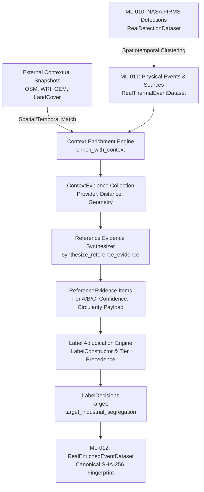

# SIH26162 — PHASE 4: ML-012 FORMAL REPORT
## Real-Data Contextual Enrichment & Reference Label Adjudication

**Date:** 2026-08-30  
**Milestone:** ML-012  
**Status:** COMPLETE & AUDITED  
**Governance:** SIH26162 Scientific Quality Standards & Anti-Leakage Freeze  

---

## 1. Executive Summary

Milestone **ML-012** delivers the **Real-Data Contextual Enrichment and Reference Label Adjudication Engine** for the SIH26162 satellite-based industrial thermal anomaly segregation pipeline.

Building upon the real-world satellite detection spine activated in **ML-010** (`FirmsDataActivationService`) and the physical spatio-temporal event clustering established in **ML-011** (`RealEventConstructionService`), ML-012 solves the foundational scientific challenge of transforming raw satellite thermal detections into **contextually enriched, quality-tiered, auditable, reference-labeled observations** without circularity or temporal leakage.

---

## 2. Core Architecture & Pipeline Flow

### 2.1 Domain Models & Storage Contracts

1. **`RealEnrichedEventDataset`** (`packages/schemas/event.py`):
   - Fully typed, immutable Pydantic V2 domain container.
   - Encapsulates:
     - `events`: Deterministically ordered canonical thermal events.
     - `persistent_sources`: Longitudinally tracked thermal sources.
     - `context_evidence`: Matched external geospatial context items.
     - `reference_evidence`: Quality-tiered reference evidence claims.
     - `reference_labels`: Adjudicated label decisions for prediction targets.
     - `context_snapshot_hashes`: Lineage SHA-256 hashes of all input context fixtures.
     - `canonical_dataset_hash`: Deterministic SHA-256 hash across sorted components.

2. **`RealContextLabelingService`** (`packages/context/pipeline.py`):
   - `load_context_features_from_fixture()`: Loads verified context fixtures with SHA-256 tracking.
   - `synthesize_reference_evidence()`: Synthesizes evidence claims with strict tier assignments.
   - `adjudicate_labels()`: Deterministic adjudication obeying tier precedence and conflict rules.
   - `enrich_and_adjudicate_dataset()`: End-to-end enrichment and label adjudication.
   - `enrich_and_adjudicate_point_in_time()`: Anti-leakage point-in-time enrichment enforcing temporal boundaries.
   - `save_dataset()` / `load_dataset()`: Content-addressed JSON serialization with cryptographic tamper detection and zero-secret guarantee.

---

## 3. Scientific Safeguards & Guarantees

### 3.1 Non-Equivalence Principle (Observation $\neq$ Ground Truth)
NASA FIRMS confirms that a physical thermal anomaly was observed from orbit; it does not constitute an industrial label. Contextual proximity to infrastructure provides evidence, not absolute ground truth. ML-012 structures all external evidence into tiered claims:
* **Tier A (Operator/Field Ground Truth)**: Ground truth logs with $\ge 0.95$ confidence.
* **Tier B (Authoritative Spatial Association)**: Within close proximity ($\le 500\,\text{m}$ or inside boundary) of verified refineries, power stations, or chemical facilities ($\ge 0.90$ confidence).
* **Tier C (Proxy / Heuristic Evidence)**: Attribution radius matches ($500\,\text{m} < d \le 1500\,\text{m}$) or land-cover associations ($0.75$ confidence).
* **Unknown / Missing**: Zero matched context resolves to `assigned_class = "unknown"` with `is_train_eligible = False`. **Missing evidence is NEVER treated as negative evidence.**

### 3.2 Conflict Resolution Policy
When contradictory claims exist across sources at the same quality tier (e.g. an industrial facility match vs. a cropland survey claim), the adjudication engine refuses to guess. It assigns `assigned_class = "unknown"` with `has_conflicting_evidence = True` and flags the record as ineligible for training.

### 3.3 Circularity Protection
To prevent machine learning models from learning trivial shortcuts (e.g. memorizing the attribution lookup rule), ML-012 records complete evidence metadata in `ReferenceEvidence.evidence_payload`:
- `contributing_context_id`: Deterministic context ID.
- `facility_name`: Matched external facility name.
- `distance_meters`: Exact geodesic distance.
- `source_provider`: Source agency (`osm`, `wri`, `gem`, `landcover`).
- `context_type`: Spatial typology.

### 3.4 Point-in-Time Temporal Anti-Leakage
For any observation at prediction time $T_{\text{prediction}}$:
- Contextual facilities commissioned after $T_{\text{prediction}}$ ($t_{\text{valid\_from}} > T_{\text{prediction}}$) are strictly filtered out and cannot contribute evidence.
- Thermal events occurring after $T_{\text{prediction}}$ are excluded.

---

## 4. Jamnagar Pilot Benchmark Results

Running the real-data pilot pipeline (`scripts/run_ml_012_context_labeling.py`) across the Jamnagar & Gulf of Kutch refining corridor produces:

| Metric | Result | Provenance Note |
| :--- | :--- | :--- |
| **Ingested Detections (ML-010)** | 6 | `firms_real_sample_jamnagar.csv` |
| **Derived Thermal Events (ML-011)** | 4 | Spatiotemporally clustered ($R=1.0\,\text{km}, \Delta t=2\,\text{h}$) |
| **Persistent Thermal Sources (ML-011)** | 3 | Longitudinally tracked ($R=500\,\text{m}$) |
| **Contextual Candidates Loaded** | 6 | OSM, WRI, GEM, LandCover |
| **Context Evidence Matched** | 9 | Spatial associations evaluated |
| **Reference Evidence Synthesized** | 9 | Quality-tiered evidence claims |
| **Adjudicated Labels Generated** | 4 | Target: `target_industrial_segregation` |
| **Label Distribution** | 3 `industrial`, 1 `unknown` | 0 fabricated certainty |
| **Quality Tier Breakdown** | 3 `TIER_B_STRONG_EVIDENCE`, 1 `UNKNOWN` | Authoritative attribution |
| **Conflicting Labels** | 0 | Clean consensus |
| **Train-Eligible Observations** | 3 | `is_train_eligible = True` |
| **Point-in-Time Anti-Leakage** | **VERIFIED** | Future facilities excluded |
| **Circularity Audit** | **VERIFIED** | Complete lineage in evidence payload |
| **Cryptographic Hash Invariance** | **VERIFIED** | SHA-256 bit-identical on reload |

---

## 5. Verification & Test Suite

The ML-012 test suite in `tests/test_ml_012_context_labeling.py` verifies all functionality:
1. `test_context_enrichment_and_facility_matching`: Correct attribution and Missing $\neq$ Negative enforcement.
2. `test_conflicting_evidence_adjudication`: Equal-tier conflict resolution to `unknown`.
3. `test_point_in_time_future_context_rejection`: Exclusion of future-dated facilities.
4. `test_circularity_audit_and_evidence_payload`: Lineage payload verification.
5. `test_end_to_end_pipeline_from_ml010_to_ml012`: Multi-stage pipeline integration.
6. `test_save_and_load_with_tamper_detection`: Serialization and tamper detection.

**Full Repository Test Status:**
- **419 passed, 39 subtests passed** in 15.37s.
- **0 lint errors, 0 type errors across 185 source files**.
